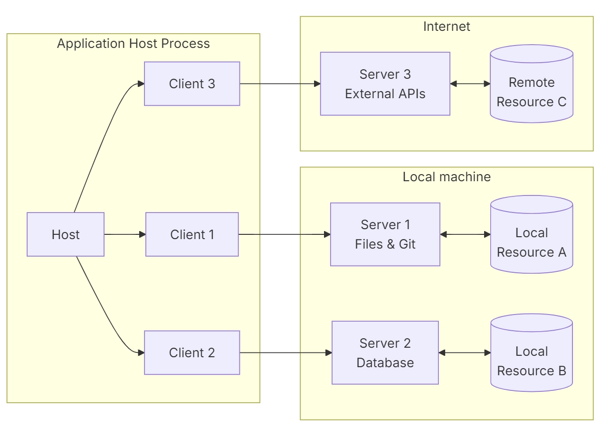
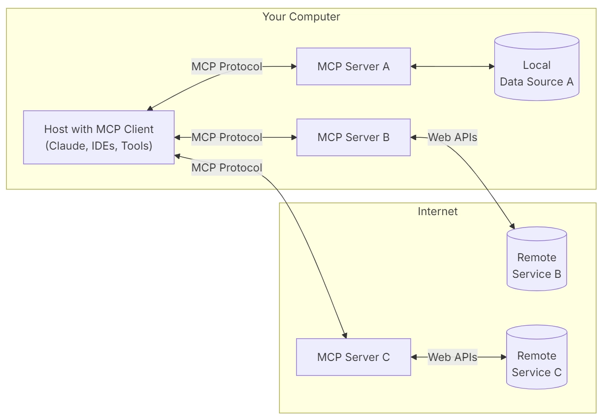
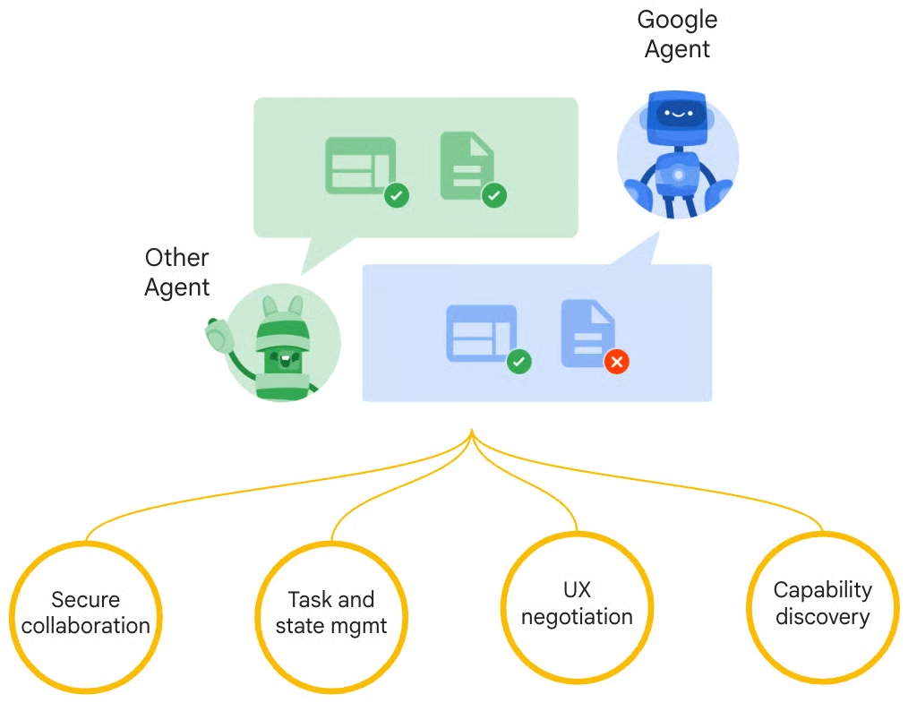
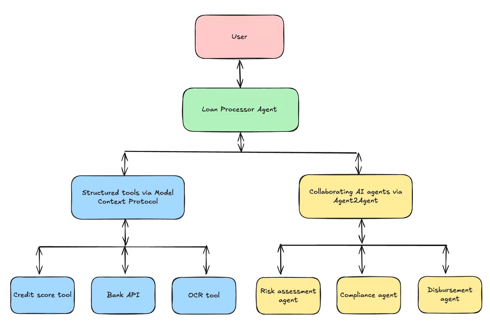

# [강습회] A2A MCP 소개

## MCP vs A2A vs ACP

### MCP (Model Context Protocol)
   * Anthropic 개발 프로토콜임.
   * LLM 기반 에이전트와 외부 도구/API 간 상호 작용 표준화 역할.
   * HTTP 기반 요청/응답 REST 인터페이스 사용함.
   * 개별 AI 모델(LLM 등)을 외부 도구 및 데이터 소스에 연결하는 데 중점 둠.
   * AI에 "실제 세계" 컨텍스트 및 기능 접근 권한 부여함.
   * 비유하자면 "작업자가 정보에 접근하는 사무실 장비"와 같음.
   * 클라이언트-서버 모델임.
   * 일반적으로 AI 클라이언트가 MCP 서버에 데이터/작업 요청하고, 서버가 외부 서비스와 상호 작용하는 요청-응답 패턴 따름.
   * 양방향 통신 및 상태 저장 세션 지원함.

 

### A2A (Agent-to-Agent)
   * 제공자: Google
   * 방식: 에이전트 간 통신을 위한 구조화된 JSON-over-HTTP
   * 특징:
      * 명확한 작업 수명 주기 지원
      * 실시간 통신 지원
      * 다양한 AI  에이전트 간 통신 및 협업 중점
      * 에이전트 기능 탐색 및 작업 위임 가능
      * "에이전트 카드" 통한 에이전트 탐색 촉진
      * 에이전트 간 피어 투 피어 통신
   * 지원 통신 방식:
      * 동기식 요청/응답
      * 스트리밍 (SSE)
      * 장기 실행 작업 비동기 푸시 알림
      * 특이사항: 양식에 구애받지 않음.

 

### ACP (Agent Communication Protocol)
   * 설계 주체: BeeAI 및 Linux 재단
   * 목표: 기본 프레임워크와 무관하게 AI 에이전트 간 상호 운용성 확보
   * 주요 기능: 다중 에이전트 시스템 내 워크플로우 오케스트레이션 및 작업 위임 중점
   * 환경: 분산 또는 로컬 환경 특화
   * 핵심 역할: 에이전트 협업 통한 복잡한 목표 달성 관리
   * 비유: 작업 조정, 할당 및 원활한 실행 담당 관리자
   * 특징:
      * 이벤트 기반 메시징 사용하는 분산 에이전트 환경
      * RESTful API 통해 동기식, 비동기식, 스트리밍 상호 작용 지원
      * 중앙 에이전트에 의한 워크플로우 오케스트레이션 강조

      * 요점 비교

| 속성 | MCP (Model Context Protocol) | A2A (Agent-to-Agent Protocol) | ACP (Agent Communication Protocol) | 
|:----:|:----:|:----:|:----:|
| 개발자 | Anthropic | Google DeepMind & 파트너 | IBM / BeeAI | 
| 도입 시기 | 2024년 11월 6 | 2025년 4월 2 | 2025년 4월/5월 2 | 
| 주요 목적 | AI를 외부 도구 및 데이터 소스에 연결 | AI 에이전트 간 통신 및 협업 가능 | 특히 로컬 환경에서 에이전트 간 워크플로우 오케스트레이션 및 작업 위임 | 
| 통신 모델 | 클라이언트-서버 (AI 호스트/클라이언트에서 MCP 서버로) | 피어 투 피어 (클라이언트 에이전트에서 원격 에이전트로) | 오케스트레이터 주도, 분산, 이벤트 기반 | 
| 핵심 상호 작용 | 도구 탐색, 함수 실행, 데이터 검색 | 에이전트 탐색 (에이전트 카드), 작업 요청, 메시지 교환, 작업 위임 | 작업 생성, 위임, 진행 상황 추적, 상태 관리 | 
| 통신 양식 | 주로 구조화된 데이터, 파일, 상황별 프롬프트 | 양식에 구애받지 않음: 텍스트, 이미지, 오디오, 비디오, 구조화된 데이터 | 다중 양식 메시지, 자연어 입력/출력 | 
| 기반 표준 | JSON-RPC 2.0 13, HTTP + SSE, Stdio | HTTP, SSE, JSON-RPC | RESTful API, HTTP 패턴, JSON-RPC | 
| 주요 기능 | 범용 도구 연결, 컨텍스트 인식, 보안 양방향 연결, SDK | 에이전트 카드, 양식에 구애받지 않는 통신, 보안 비동기 작업, 프레임워크 상호 운용성, 구성 가능성 | 워크플로우 오케스트레이션, 작업 위임, 상태 저장 세션, 관찰 가능성, 기능 토큰, 로컬 우선 최적화 | 
| 일반적인 사용 사례 | CRM 데이터 검색, IDE 컨텍스트 접근, 자연어 데이터 접근 (AI2SQL), 다중 도구 에이전트 워크플로우 | 다중 에이전트 협업 (예: 번역가-일러스트레이터, 대출 처리), 교차 플랫폼 에이전트 통신 | 엣지 컴퓨팅, 로봇 공학, IoT, 개인 정보 보호에 민감한 환경, 기업 자동화 워크플로우, 보안 사고 대응 | 
| 강점 | 표준화, AI 유용성 향상, 플러그 앤 플레이, 빠른 채택, 개발 간소화 | 상호 운용성, 확장성, 유연성 (작업 기간/양식), 기본적으로 보안 | 로컬 우선 최적화, 강력한 보안, 감사 가능한 작업, 동적 탐색, 글루 코드 감소 | 
| 약점 | 보안 취약성 (프롬프트 주입, 데이터 유출), ID 관리 모호성, 상태 비저장 API를 위한 상태 저장 프로토콜 복잡성 | 상호 운용성 장벽 (의미론적 불일치), 보안 구현 부담, 지점 간 확장성 딜레마 ("N-제곱 문제") | 잠재적 상태 비저장 문제, 일대일 통신 제한, 초기 개발 단계 | 
| 보완적 역할 | 개별 에이전트에 외부 도구/데이터 접근 제공 | 에이전트가 서로를 탐색하고 통신할 수 있도록 함 | 복잡한 작업에서 에이전트가 함께 작동하는 방식 조정 | 

