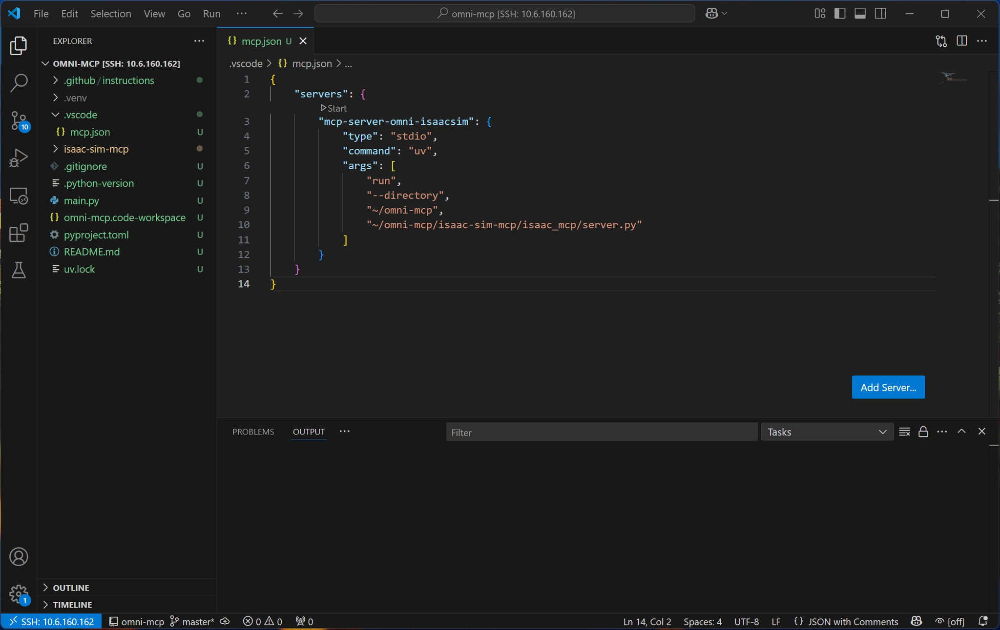

# [강습회] Isaac Sim + MCP (Omni-MCP) 튜토리얼

**튜토리얼 환경:**

- Ubuntu 22.04
- Isaac Sim 4.5
- VS Code
- Github Copilot (가입 필요)
- MCP Server/Client

# 튜토리얼

1. **uv 설치 (Ubuntu 22.04)**
    
    ```bash
    # On Linux
    curl -LsSf https://astral.sh/uv/install.sh | sh
    ```
    

1. **venv 기반 MCP 서버를 위한 uv 환경 초기화**
    
    ```bash
    # Create @ specific folder
    uv init omni-mcp
    cd ~/omni-mcp
    
    # Create venv @ omni-mcp folder
    uv venv
    source .venv/bin/activate
    ```
    
2. **MCP CLI 설치**
    
    ```bash
    # https://pypi.org/project/mcp/
    uv pip install "mcp[cli]==1.12.2"
    ```
    
3. **Omni-MCP Git Clone**
    
    ```bash
    git clone https://github.com/omni-mcp/isaac-sim-mcp
    ```
    
4. **Isaac Sim 실행 (Omni-MCP Extension 활성화)**
    
    ```bash
    # New Terminal
    ~/isaacsim/isaac-sim.sh --ext-folder ~/omni-mcp/isaac-sim-mcp/ --enable isaac.sim.mcp_extension
    ```
    
5. **VS Code | File > Open Folder | omni-mcp**
6. **VS Code | .vscode 폴더 밑에 `mcp.json` 파일 세팅**
    - 단축키: `Ctrl+Shift+P`  | MCP: Add Server
    
    ```json
    {
        "servers": {
            "mcp-server-omni-isaacsim": {
                "type": "stdio",
                "command": "uv",
                "args": [
                    "run",
                    "--directory",
                    "~/omni-mcp",
                    "~/omni-mcp/isaac-sim-mcp/isaac_mcp/server.py"
                ]
            }
        }
    }
    ```
    
    ```bash
    # Check uv MCP server
    uv run --directory ~/omni-mcp ~/omni-mcp/isaac-sim-mcp/isaac_mcp/server.py
    ```
    
    
    
7. **VS Code + Copilot (Agent 모드 설정)**
    - Copilot 로그인 필요
8. **Agent를 위한 Instructions.md 설정**
    - Add Context | Instructions | Config Instruction
    
    ```bash
    ---
    applyTo: '**'
    ---
    # Isaac Sim MCP Rules
    
    ## General Rules
    - Before executing any code, always check if the scene is properly initialized by calling get_scene_info()
    - When working with robots, try using create_robot() first before using execute_script()
    - If execute_script() fails due to communication error, retry up to 3 times at most
    - For any creation of robot, call create_physics_scene() first
    - Always print the formatted code into chat to confirm before execution
    
    ## Physics Rules
    - If the scene is empty, create a physics scene with create_physics_scene()
    - For physics simulation, avoid using simulation_context to run simulations in the main thread
    - Use the World class with async methods for initializing physics and running simulations
    - When needed, use my_world.play() followed by multiple step_async() calls to wait for physics to stabilize
    
    ## Robot Creation Rules
    - Before creating a robot, verify availability of connection with get_scene_info()
    - Available robot types: "franka", "jetbot", "carter", "g1", "go1"
    - Position robots using their appropriate parameters
    - For custom robot configurations, use execute_script() only when create_robot() is insufficient
    
    ## Physics Scene Rules
    - Objects should include 'type' and 'position' at minimum
    - Object format example: {"path": "/World/Cube", "type": "Cube", "size": 20, "position": [0, 100, 0]}
    - Default gravity is [0, 0, -981.0] (cm/s^2)
    - Set floor=True to create a default ground plane
    
    ## Script Execution Rules
    - Use World class instead of SimulationContext when possible
    - Initialize physics before trying to control any articulations
    - When controlling robots, make sure to step the physics at least once before interaction
    - For robot joint control, first initialize the articulation, then get the controller 
    ```
    .github/instructions/Isaac Sim MCP [Rules.instructions.md](http://rules.instructions.md/)


    
9. **실행 데모**
- Demo Prompts
    
    ```bash
    # Create robots and improve lighting
    create 3x3 frankas robots in these current stage across location [3, 0, 0] and [6, 3, 0].
    always check connection with get_scene_info before execute code.
    add more light in the stage.
    
    # Add specific robots at positions
    create a g1 robot at [3, 9, 0].
    add Go1 robot at location [2, 1, 0].
    move go1 robot to [1, 1, 0].
    ```
    
    [Omni-MCP 실행화면](attachment:6e71ead2-df46-4a4e-afe3-cc08cb83584f:isaac_mcp_test_250605.mp4)
    
    Omni-MCP 실행화면
    

# 기타 명령어

<aside>

💡 **venv 관련 명령어**

```bash
python -m venv 가상환경이름
source 가상환경이름/bin/activate
deactivate
sudo rm -rf 가상환경이름
```

</aside>

<aside>

💡 **MCP Server 실행**

```bash
# Isaac Sim should be started w/ isaac.sim.mcp_extension before run below.
uv run ~/omni-mcp/isaac-sim-mcp/isaac_mcp/server.py

# Development Mode (For Debug -- http://localhost:5173)
uv run mcp dev ~/omni-mcp/isaac-sim-mcp/isaac_mcp/server.py

# If error for Development Mode
# Install latest LTS version using NodeSource
curl -fsSL https://deb.nodesource.com/setup_lts.x | sudo -E bash -
sudo apt-get install -y nodejs
```

</aside>

<aside>

💡 **방화벽 관련 명령어**

```bash
# 방화벽
sudo ufw enable
sudo ufw allow 6277/tcp
sudo ufw allow 6274/tcp
sudo ufw allow 8766/tcp
sudo ufw status
```

</aside>

<aside>


💡 **Ollama 관련**

```bash
# Ollama 설치
curl -fsSL https://ollama.com/install.sh | sh
```

```python
# Ollama 명령어
ollama run gemma3:4b

ollama list

ollama rm <model name>
```

</aside>
