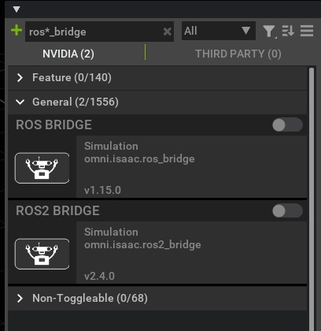

# [강습회] Isaac Sim + ROS2 설치

# **Running Native ROS**

- **Isaac Sim은 Python 3.10**으로 컴파일된 `rclpy`이 사전 패키징되어 있음. (내부 ROS 2 배포판 빌드)
- **`ROS_DISTRO` 환경 변수가 ROS 2 소싱 여부 및 사용할 배포판 결정함.**
    - 이 변수가 설정 안 되면, 내부 ROS 2 배포판 빌드가 사용됨.

<aside>
💡

- **ROS 2 브릿지 쓸 때:** Isaac Sim 실행 전 터미널에서 ROS 2 설치 소싱해야 함.
- **ROS 2 소싱이 `bashrc`에 포함돼 있다면:** Isaac Sim 바로 실행해도 됨.
</aside>

### **ROS 2 (Humble) — Ubuntu 22.04 설치**

1. **ROS 2 Humble (Ubuntu 22.04) 공식 웹사이트 지침에 따라 다운로드.** [ROS 2 Humble Ubuntu 22.04](https://docs.ros.org/en/humble/Installation/Ubuntu-Install-Debians.html)
2. **(선택 사항) `vision_msgs` 패키지 설치:**
    - ROS 2 브릿지의 일부 메시지 타입 (`Detection2DArray`, `Detection3DArray` - 바운딩 박스 발행용)은 `vision_msgs` 패키지에 의존함.
    - 필요 시 다음 명령어로 설치:
        
        ```bash
        sudo apt install ros-humble-vision-msgs
        ```
        
    - `vision_msgs` 사용 안 하면 이 단계 건너뛰어도 됨.
3. **(선택 사항) `ackermann_msgs` 패키지 설치:**
    - ROS 2 브릿지의 일부 메시지 타입 (`AckermannDriveStamped` - Ackermann 조향 명령 발행/구독용)은 `ackermann_msgs` 패키지에 의존함.
    - 필요 시 다음 명령어로 설치:
        
        ```bash
        sudo apt install ros-humble-ackermann-msgs
        ```
        
    - `ackermann_msgs` 사용 안 하면 이 단계 건너뛰어도 됨.
4. **ROS 환경 소싱 확인:**
    - 터미널이나 `~/.bashrc` 파일에 ROS 환경이 소싱되었는지 확인 필수.
    - ROS 명령어 사용하거나 Isaac Sim 실행하기 전에 매번 이 단계 수행해야 함.
    - 소싱 명령어:
        
        ```bash
        source /opt/ros/humble/setup.bash
        ```
        

# **[필수] Setting Up Workspaces**

- Isaac Sim ROS 및 ROS 2 튜토리얼 진행에 필요한 ROS 패키지들 있음.
- `isaac-sim/IsaacSim-ros_workspaces`에서 Isaac Sim ROS 워크스페이스 GitHub 저장소 클론하면 됨.
    
    ```bash
    git clone https://github.com/isaac-sim/IsaacSim-ros_workspaces.git
    ```
    
- **ROS 2 (Humble) — Ubuntu 22.04**
    - **소스에서 ROS 2 빌드했다면:** 추가 워크스페이스 빌드 전 `source /opt/ros/<ros_distro>/setup.bash` 대신 `source <path_ros2_ws>/install/setup.bash`로 소싱해야 함.
    - **워크스페이스 빌드:**
        1. **추가 패키지 설치 필요할 수 있음:**
            
            ```bash
            # For rosdep install command
            sudo apt install python3-rosdep python3-rosinstall python3-rosinstall-generator python3-wstool build-essential
            # For colcon build command
            sudo apt install python3-colcon-common-extensions
            ```
            
        2. **네이티브 ROS 2 소싱 확인:**
            
            ```bash
            source /opt/ros/humble/setup.bash
            ```
            
        3. **패키지 의존성 해결 (ROS 2 워크스페이스 루트에서):**
            
            ```bash
            cd IsaacSim-ros_workspaces/humble_ws
            sudo rosdep init
            rosdep update
            rosdep install -i --from-path src --rosdistro humble -y
            ```
            
        4. **워크스페이스 빌드:**
            
            ```bash
            colcon build
            ```
            
            - 빌드 후 루트 디렉토리에 `build`, `install`, `log` 새 디렉토리 생성됨.
        5. **빌드된 ROS 2 패키지 사용 시작:** 새 터미널 열고 다음 명령어로 워크스페이스 소싱.
            
            ```bash
            source /opt/ros/humble/setup.bash
            cd humble_ws
            source install/local_setup.bash
            ```
            

# **Running ROS without a System Level Install**

- **가장 간단한 방법:**
    - Isaac Sim 앱 셀렉터에서 옵션 설정하면 됨 (`~/isaacsim/isaac-sim.selector.sh` 실행).
- **터미널에서 내부 ROS 2 라이브러리 활성화 방법:**
    - Isaac Sim이 기본 위치에 설치 안 됐다면, `isaac_sim_package_path` 환경 변수를 Isaac Sim 경로로 교체
    - **Linux인 경우**
        
        ```bash
        
        export isaac_sim_package_path=$HOME/isaacsim # Isaac Sim 설치 경로 설정
        export RMW_IMPLEMENTATION=rmw_fastrtps_cpp # RMW 구현체 설정
        
        # 터미널당 한 번만 설정 가능.
        # 여러 번 설정 시 내부 라이브러리 경로가 중복 추가되어 충돌 발생 가능성 있음.
        export LD_LIBRARY_PATH=$LD_LIBRARY_PATH:$isaac_sim_package_path/exts/isaacsim.ros2.bridge/humble/lib
        
        # Isaac Sim 실행
        $isaac_sim_package_path/isaac-sim.sh
        ```
        

# **Enabling the ROS Bridge Extension**

- **동일 머신에서 ROS 2 노드와 통신 시:**
    - **FastDDS 기본 설정 그대로 사용.**
    - 이렇게 하면 공유 메모리 전송이 사용되어 시뮬레이션 성능이 최적화됨.
- **동일 네트워크 내 다른 머신의 ROS 노드에 연결 시:**
    - Isaac Sim 실행 전, ROS 2 메시지를 주고받을 모든 터미널에서 Fast DDS 미들웨어 설정 및 UDP 전송 활성화해야 함.
    - **Isaac Sim ROS 2 워크스페이스 사용하는 경우:**
        - `<ros2_ws>` 폴더 루트에 `fastdds.xml` 파일 있음.
        - ROS 2 기능 사용할 모든 터미널에서 `export FASTRTPS_DEFAULT_PROFILES_FILE=<ros2_ws 경로>/fastdds.xml` 명령어로 환경 변수 설정.
            
            <aside>
            ⚠️
            
            ## 📄 **`FASTRTPS_DEFAULT_PROFILES_FILE`의 역할**
            
            이 환경 변수는 **Fast DDS (이전 이름: Fast RTPS)** 라이브러리가 실행될 때 **기본적으로 사용할 XML 설정 파일**의 경로를 지정함.
            
            ### 🔧 **Fast DDS에서 XML 프로파일의 목적**
            
            Fast DDS는 통신 설정(예: QoS, 트랜스포트, 히스토리 설정 등)을 XML 파일에 정의할 수 있음.
            
            이 XML 파일에는 여러 **프로파일(profile)** 을 정의할 수 있고, 노드나 퍼블리셔, 서브스크라이버 생성 시 이 프로파일을 지정하여 쉽게 설정을 적용할 수 있음.
            
            </aside>
            
    - **Isaac Sim ROS 2 워크스페이스 사용 안 하는 경우:**
        - `~/.ros/` 경로에 `fastdds.xml` 파일 생성.
        - 파일 안에 다음 snippet 내용 붙여넣기:
            
            ```xml
            <?xml version="1.0" encoding="UTF-8" ?>
            
            <license>Copyright (c) 2025, NVIDIA CORPORATION.  All rights reserved.
            NVIDIA CORPORATION and its licensors retain all intellectual property
            and proprietary rights in and to this software, related documentation
            and any modifications thereto.  Any use, reproduction, disclosure or
            distribution of this software and related documentation without an express
            license agreement from NVIDIA CORPORATION is strictly prohibited.</license>
            
            <profiles xmlns="http://www.eprosima.com/XMLSchemas/fastRTPS_Profiles" >
                <transport_descriptors>
                    <transport_descriptor>
                        <transport_id>UdpTransport</transport_id>
                        <type>UDPv4</type>
                    </transport_descriptor>
                </transport_descriptors>
            
                <participant profile_name="udp_transport_profile" is_default_profile="true">
                    <rtps>
                        <userTransports>
                            <transport_id>UdpTransport</transport_id>
                        </userTransports>
                        <useBuiltinTransports>false</useBuiltinTransports>
                    </rtps>
                </participant>
            </profiles>
            ```
            
        - 터미널에서 `export FASTRTPS_DEFAULT_PROFILES_FILE=~/.ros/fastdds.xml` 실행.
- **(선택 사항) `ROS_DOMAIN_ID` 설정:**
    - Isaac Sim 실행 전 `export ROS_DOMAIN_ID=(id_number)` 실행.
    - 나중에 환경 내에서 이 `ROS_DOMAIN_ID`를 사용할지, 아니면 특정 토픽에 대해 다른 ID 번호를 명시적으로 사용할지 결정 가능.
- **Enable Extension**
    - **활성화 방법:**
        - 메뉴에서 `Window > Extensions`로 이동.
        - 검색창에 "ROS 2 bridge" 검색.
    - **중요 사항:**
        - ROS 브릿지 확장 기능은 **한 번에 하나만 활성화 가능.**
        - 두 브릿지(ROS 1 ↔ ROS 2) 간 전환 시, **하나를 비활성화한 다음 다른 하나를 활성화**해야 함.
        
        
        

# **Choosing the ROS Bridge Version in isaac-sim.sh**

- **ROS 2 브릿지는 기본 활성화 상태임.**
- `isaac-sim.sh` 실행 중이거나 ROS 브릿지 전환 원하면 다음 단계 따르면 됨:
    1. `~/isaacsim/apps/isaacsim.exp.full.kit` 파일 열기.
    2. `isaac.startup.ros_bridge_extension = "isaacsim.ros2.bridge"` 라인 찾아서:
        - `isaac.startup.ros_bridge_extension = ""` 로 변경하면 **두 브릿지 모두 비활성화됨.**
        - `isaac.startup.ros_bridge_extension = "isaacsim.ros1.bridge"` 로 변경하면 **ROS 1 브릿지가 자동으로 로드됨.**
    3. 파일 저장하고 닫기.

# ROS 2 packages for NVIDIA Isaac Sim

- **`carter_navigation`:** NVIDIA Carter 로봇에 필요한 런치 파일과 ROS 2 내비게이션 파라미터 포함.
- **`cmdvel_to_ackermann`:** 명령 속도 메시지(Twist msg 타입)를 Ackermann Drive 메시지(AckermannDriveStamped msg 타입)로 변환하는 스크립트 파일 및 런치 파일 포함.
- **`custom_message`:** NVIDIA Carter 로봇에 필요한 런치 파일과 ROS 2 내비게이션 파라미터 포함.
- **`isaac_ros_navigation_goal`:** ROS 2 내비게이션에서 랜덤 또는 사용자 정의 목표 포즈 자동 설정에 사용됨.
- **`isaac_ros2_messages`:** 포즈 검색, 프림 목록화, 속성 조작을 위한 사용자 정의 ROS 2 서비스 인터페이스 세트.
- **`isaacsim`:** Isaac Sim을 ROS2 노드로 실행 및 런치하는 런치 파일과 스크립트 포함.
- **`isaac_tutorials`:** 튜토리얼 시리즈용 런치 파일, RViz2 설정 파일, 스크립트 포함.
- **`iw_hub_navigation`:** iw.hub 로봇에 필요한 런치 파일과 ROS 2 내비게이션 파라미터 포함.

# **참고문헌**

https://docs.isaacsim.omniverse.nvidia.com/4.5.0/installation/install_ros.html#isaac-sim-app-install-ros
